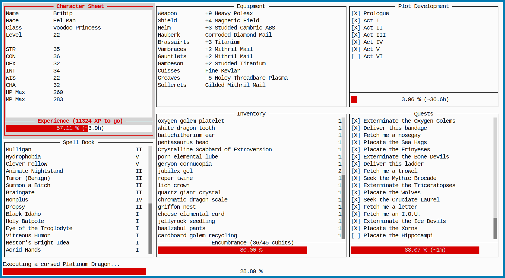

<p align="center">
  
</p>

Relive the great adventure… this time in the terminal realm!

- Progress Quest site:  http://progressquest.com/
- Online version:       http://progressquest.com/play/
- Original version:     https://bitbucket.org/grumdrig/pq

## Features

- Saves (with backups) to `$XDG_CONFIG_HOME/pqcli/save.dat`
- Clean terminal interface
    - Smooth progress bars using UTF-8 block characters
    - Scrollable list boxes
- Faithful port of the game logic
- Ideal to run on your server

## How it looks like



## How to install

If you have Python 3.7, just run `pip install --user pqcli` and you're good to go!
Then type `pqcli` to run the game.

In case if you want to use the git version, the process is just a little bit
more complex:

```console
$ git clone https://github.com/rr-/pq-cli.git
$ cd pq-cli
$ pip install --user .
```
