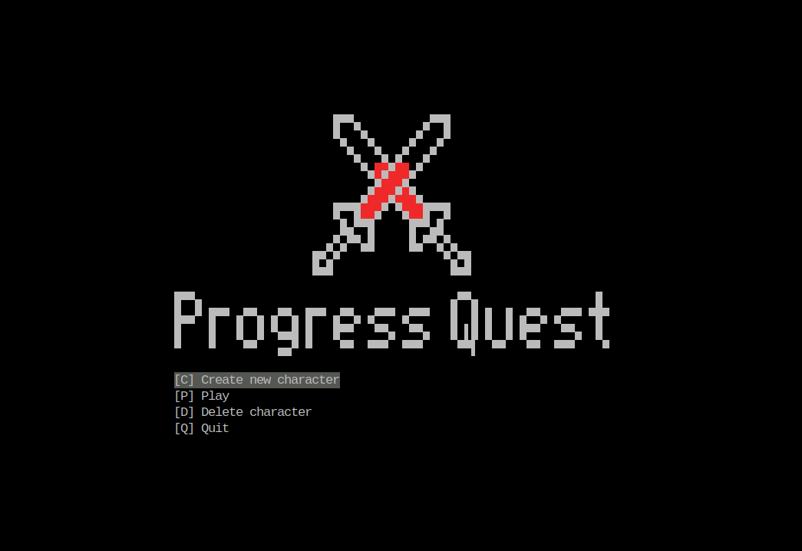
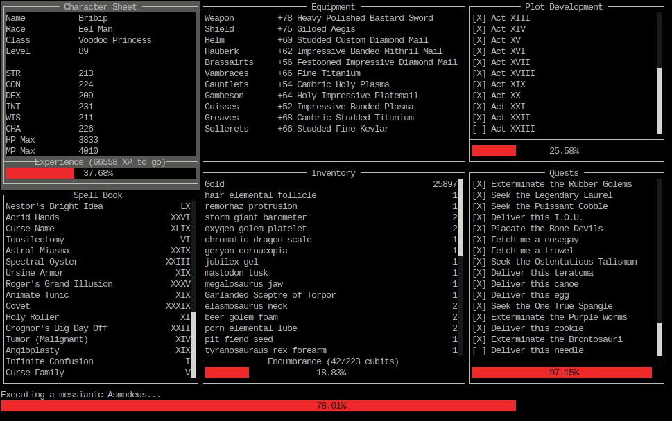
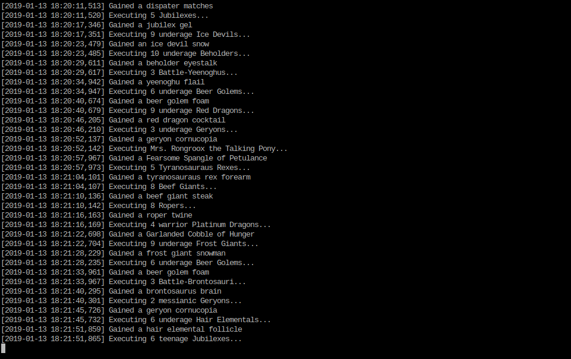

<p align="center">
  
</p>

Relive the great adventure… this time in the terminal realm!

- Progress Quest site:  http://progressquest.com/
- Online version:       http://progressquest.com/play/
- Original version:     https://bitbucket.org/grumdrig/pq

## Features

- Faithful port of the game logic
- Saves (with backups) to `$XDG_CONFIG_HOME/pqcli/save.dat`
- Terminal interface that comes in 2 flavors:
    - Rich and colorful (`--curses`, default)
    - Minimal, suitable for raw grind (`--basic`)
- Ideal to run on your server

## How it looks like

Curses interface:




Basic interface:



## How to install

If you have Python 3.7, just run `pip install --user pqcli` and you're good to go!
Then type `pqcli` to run the game.

In case if you want to use the git version, the process is just a little bit
more complex:

```console
$ git clone https://github.com/rr-/pq-cli.git
$ cd pq-cli
$ pip install --user .
```

## Troubleshooting

### `_curses.error: init_pair() returned ERR`

If running on Linux and you get the error `_curses.error: init_pair() returned ERR`,
try making sure that your `$TERM` variable is set to a value which supports
256 colors, such as via the following:

    TERM=xterm-256color pqcli

